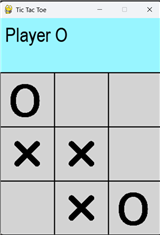

# Tic-Tac-Toe Reinforcement Learning Tutorial


This repository is a tutorial project that builds a playable Tic-Tac-Toe game in Python and uses it to introduce simple reinforcement learning agents.

The `main` branch is intentionally incomplete. It is meant for practice, so key parts of the AI and training logic are left for the learner to implement. The answer branches contain completed versions.

**Keywords:** Tic-Tac-Toe, Reinforcement Learning, Python, Pygame, Monte Carlo, SARSA, Q-table, AI agent, tutorial, game development, machine learning, RL practice project

| What this repo gives you |  | Preview |
| --- | --- | --- |
| • Playable Tic-Tac-Toe built with `pygame`.<br>• A small, readable environment for RL practice.<br>• Tutorial scaffolding for Monte Carlo and SARSA.<br>• Separate answer branches with completed implementations. | &nbsp;&nbsp;&nbsp;&nbsp;&nbsp;&nbsp;&nbsp;&nbsp;&nbsp;&nbsp;&nbsp;&nbsp; |  |

## Table of Contents

1. [🎯 Project Overview](#project-overview)
2. [🧠 Learning Goals](#learning-goals)
3. [🛠️ Tech Stack](#tech-stack)
4. [📁 Project Structure](#project-structure)
5. [🎮 How the Project Works](#how-the-project-works)
6. [🚀 Getting Started](#getting-started)
7. [▶️ Running the Project](#running-the-project)
8. [✨ Why This Repo Is Useful](#why-this-repo-is-useful)
9. [📚 Tutorial Note](#tutorial-note)
10. [🌿 Answer Branches](#answer-branches)

## Project Overview

The project combines three pieces:

- A Tic-Tac-Toe game environment.
- A graphical interface built with `pygame`.
- AI agents based on Monte Carlo control and SARSA.

You can use this project to:

- Play Tic-Tac-Toe against the computer.
- Study states, actions, rewards, and episode generation in a small environment.
- Practice implementing reinforcement learning on a problem that is easy to inspect and debug.

## Learning Goals

This repository is useful for learning or teaching:

- How to model a simple environment with states, legal actions, transitions, and terminal rewards.
- How a Q-table can drive action selection.
- How epsilon-greedy exploration works.
- How Monte Carlo and SARSA training loops are structured.
- How to connect a trained agent to a playable graphical game.

## Tech Stack

- Python
- `pygame` for the UI
- `numpy` for board/state operations
- `torch` for saving and loading Q-tables

## Project Structure

- `Game.py` - playable game loop.
- `TicTacToe.py` - environment logic, legal moves, state transitions, and terminal checks.
- `State.py` - board state container and helpers.
- `Graphics.py` - board rendering and mouse-to-cell conversion.
- `Human_Agent.py` - mouse-controlled human player.
- `Random_Agent.py` - random baseline agent.
- `AI_Agent.py` - Q-table agent with greedy and epsilon-greedy action selection.
- `MC_Trainer.py` - Monte Carlo training tutorial.
- `SARSA_Trainer.py` - SARSA training tutorial.
- `Tester.py` - simple evaluation script.
- `Data/` - saved Q-table checkpoints.
- `img/` - images used by the UI.

## How the Project Works

The game uses a 3x3 board where:

- `1` represents player `X`.
- `-1` represents player `O`.
- `0` represents an empty square.

The environment:

- Checks whether a move is legal.
- Applies actions to the board.
- Switches players after each move.
- Detects wins, losses, and ties.

The AI agent stores action values in a Q-table keyed by `(state, action)` and can:

- Pick the currently best-known action.
- Explore with epsilon-greedy action selection during training.
- Load previously saved Q-tables from the `Data/` folder.

## Getting Started

Install the dependencies:

```bash
pip install pygame numpy torch
```

## Running the Project

Run the game:

```bash
python Game.py
```

Run a training script:

```bash
python MC_Trainer.py
python SARSA_Trainer.py
```

Run the evaluation script:

```bash
python Tester.py
```

## Why This Repo Is Useful

- Small enough to understand quickly, but rich enough to demonstrate real RL ideas.
- Useful for tutorials, homework, workshops, or self-study.
- Lets you move from environment design to training to a playable UI in one repository.
- Includes separate answer branches so learners can compare their work against completed implementations.

## Tutorial Note

The `main` branch does not include the full answers.

It is intentionally left incomplete for tutorial use. Missing pieces include core parts of the reinforcement learning workflow, such as:

- The epsilon-greedy schedule in `AI_Agent.py`.
- Episode generation and the Monte Carlo training flow in `MC_Trainer.py`.
- The SARSA training logic in `SARSA_Trainer.py`.

That makes `main` a practice branch for classroom work, guided exercises, or self-study.

## Answer Branches

The completed solutions are provided in separate branches.

### solved

This branch contains the full tutorial solution set.

It includes:

- A completed epsilon-greedy implementation in the AI agent.
- A working Monte Carlo training loop.
- A working SARSA training loop.
- Additional saved Q-table checkpoints in `Data/`.
- Updates to the game and testing flow to use trained models.

Use this branch if you want the full reference answer for the tutorial.

### TicTacToe_SARSA

This branch focuses on the SARSA solution path.

It includes:

- A completed epsilon-greedy policy for training.
- A filled-in SARSA trainer.
- Game configuration that uses a SARSA-trained Q-table.
- A narrower setup centered on the SARSA workflow.

Use this branch if you want to study the SARSA answer directly without the broader set of tutorial solutions.

